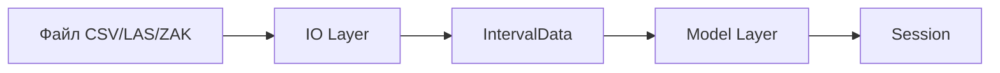
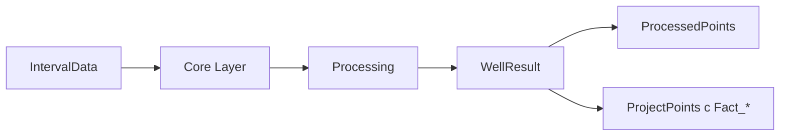
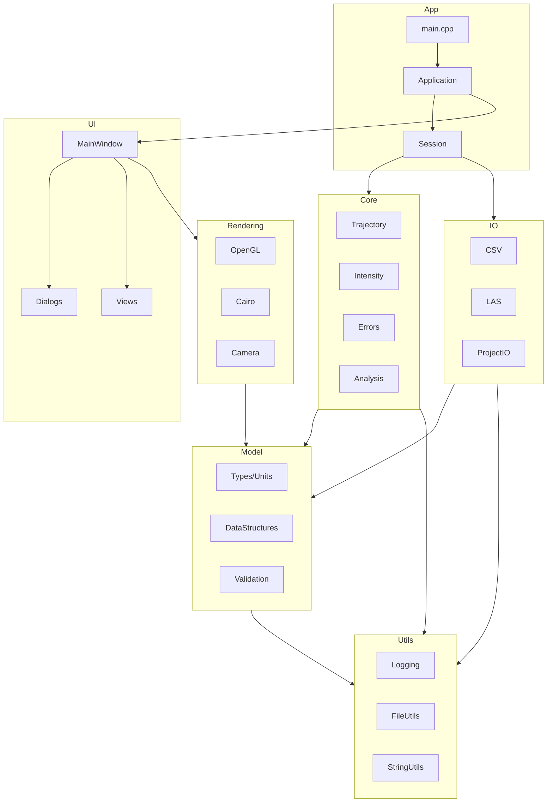

# Архитектура Incline3D

## Обзор

Incline3D — монолитное кроссплатформенное приложение с графическим интерфейсом, построенное на GTK4 и OpenGL. Приложение имеет слоистую архитектуру с чётким разделением ответственности между компонентами.

## Принципы проектирования

1. **Монолитная сборка** — один исполняемый файл без внешних зависимостей времени выполнения (кроме GTK и OpenGL)
2. **Слоистая архитектура** — каждый слой зависит только от нижележащих
3. **Строгая типизация** — использование типов-обёрток для единиц измерения
4. **RAII** — управление ресурсами через конструкторы/деструкторы
5. **Неизменяемость по умолчанию** — предпочтение `const` и иммутабельных структур

## Архитектурные слои

```
┌─────────────────────────────────────────────────────────────┐
│                        App Layer                            │
│              (main, Application, сборка компонентов)        │
├─────────────────────────────────────────────────────────────┤
│                        UI Layer                             │
│         (GTK окна, диалоги, виджеты, контроллеры)          │
├──────────────────────┬──────────────────────────────────────┤
│    Rendering Layer   │              IO Layer                │
│  (OpenGL 3D, Cairo)  │  (CSV, LAS, ZAK, Project files)     │
├──────────────────────┴──────────────────────────────────────┤
│                       Core Layer                            │
│    (алгоритмы траектории, интенсивности, ошибки, анализ)   │
├─────────────────────────────────────────────────────────────┤
│                      Model Layer                            │
│           (структуры данных, типы единиц, валидация)        │
├─────────────────────────────────────────────────────────────┤
│                      Utils Layer                            │
│        (логирование, файловые операции, строки, конфиг)     │
└─────────────────────────────────────────────────────────────┘
```

## Описание слоёв

### Utils Layer (`src/utils/`)

Базовые утилиты, не зависящие от предметной области:

| Модуль | Назначение |
|--------|------------|
| `logging.hpp/cpp` | Система логирования с уровнями (DEBUG, INFO, WARN, ERROR) |
| `file_utils.hpp/cpp` | Атомарная запись файлов, работа с путями |
| `string_utils.hpp/cpp` | Конвертация кодировок, парсинг чисел |
| `config.hpp/cpp` | Чтение/запись конфигурации приложения |
| `math_utils.hpp/cpp` | Математические константы, тригонометрия |

### Model Layer (`src/model/`)

Структуры данных предметной области:

| Модуль | Назначение |
|--------|------------|
| `units.hpp` | Типы единиц: `Degrees`, `Radians`, `Meters` |
| `types.hpp` | Базовые типы: `OptionalAngle`, `Coordinate`, `WellId` |
| `measurement.hpp` | `MeasurementPoint` — точка замера |
| `interval_data.hpp` | `IntervalData` — исходные данные интервала |
| `processed_point.hpp` | `ProcessedPoint` — результат обработки точки |
| `well_result.hpp` | `WellResult` — полные результаты обработки скважины |
| `project_point.hpp` | `ProjectPoint` — проектная точка (целевой пласт) |
| `shot_point.hpp` | `ShotPoint` — пункт возбуждения |
| `project.hpp` | `Project` — проект (набор скважин + настройки) |
| `validation.hpp` | Функции валидации данных |

### Core Layer (`src/core/`)

Алгоритмы обработки данных:

| Модуль | Назначение |
|--------|------------|
| `angle_utils.hpp/cpp` | Нормализация углов, усреднение, переход 0/360 |
| `trajectory.hpp/cpp` | Расчёт траектории (AA, BT, MC, RingArc) |
| `dogleg.hpp/cpp` | Расчёт пространственной интенсивности (dogleg) |
| `intensity.hpp/cpp` | Интенсивность на 10м и на L м |
| `errors.hpp/cpp` | Расчёт погрешностей (X, Y, ABSG, INT) |
| `interpolation.hpp/cpp` | Интерполяция по глубине для проектных точек |
| `analysis.hpp/cpp` | Анализ сближения и отхода |
| `processing.hpp/cpp` | Координация полной обработки скважины |

### IO Layer (`src/io/`)

Чтение и запись файлов:

| Модуль | Назначение |
|--------|------------|
| `csv_reader.hpp/cpp` | Чтение CSV с настраиваемым маппингом полей |
| `csv_writer.hpp/cpp` | Запись CSV с выбором разделителя и кодировки |
| `las_reader.hpp/cpp` | Чтение LAS 2.0 |
| `las_writer.hpp/cpp` | Запись LAS 2.0 |
| `zak_reader.hpp/cpp` | Чтение формата ZAK |
| `project_io.hpp/cpp` | Чтение/запись проекта (*.inclproj) |
| `export_templates.hpp/cpp` | Шаблоны экспорта (*.mkl, *.mkz) |
| `format_registry.hpp/cpp` | Реестр форматов, автоопределение |

### Rendering Layer (`src/rendering/`)

Визуализация данных:

| Модуль | Назначение |
|--------|------------|
| `gl_context.hpp/cpp` | Инициализация OpenGL контекста |
| `shader_program.hpp/cpp` | Загрузка и управление шейдерами |
| `trajectory_renderer.hpp/cpp` | Отрисовка траекторий в 3D |
| `grid_renderer.hpp/cpp` | Отрисовка сеток и осей |
| `project_point_renderer.hpp/cpp` | Отрисовка проектных точек и кругов допуска |
| `shot_point_renderer.hpp/cpp` | Отрисовка пунктов возбуждения |
| `camera.hpp/cpp` | Управление камерой (вращение, панорама, зум) |
| `axonometry_view.hpp/cpp` | 3D аксонометрия |
| `plan_view.hpp/cpp` | 2D план (Cairo) |
| `vertical_view.hpp/cpp` | Вертикальная проекция (Cairo) |
| `image_export.hpp/cpp` | Экспорт в PNG/BMP, копирование в буфер |

### UI Layer (`src/ui/`)

Графический интерфейс GTK4:

| Модуль | Назначение |
|--------|------------|
| `main_window.hpp/cpp` | Главное окно приложения |
| `menu_bar.hpp/cpp` | Главное меню |
| `toolbar.hpp/cpp` | Панель инструментов |
| `well_list_view.hpp/cpp` | Таблица скважин |
| `project_points_view.hpp/cpp` | Таблица проектных точек |
| `shot_points_view.hpp/cpp` | Таблица пунктов возбуждения |
| `measurement_editor.hpp/cpp` | Редактор замеров |
| `settings_dialog.hpp/cpp` | Диалог настроек |
| `processing_dialog.hpp/cpp` | Диалог параметров обработки |
| `import_dialog.hpp/cpp` | Диалог импорта с маппингом полей |
| `export_dialog.hpp/cpp` | Диалог экспорта |
| `about_dialog.hpp/cpp` | Диалог "О программе" |

### App Layer (`src/app/`)

Точка входа и сборка компонентов:

| Модуль | Назначение |
|--------|------------|
| `main.cpp` | Точка входа `main()` |
| `application.hpp/cpp` | Класс `Application`, жизненный цикл GTK |
| `session.hpp/cpp` | Сессия работы с данными, состояние приложения |

## Потоки данных

### Импорт данных



### Обработка данных



### Визуализация


### Экспорт данных


## Стратегия обработки ошибок

### Типы ошибок

1. **Программные ошибки** (assert, panic) — баги в коде, не должны происходить
2. **Ошибки данных** — некорректный ввод пользователя, повреждённые файлы
3. **Системные ошибки** — нехватка памяти, ошибки ввода-вывода

### Механизмы

```cpp
// Для ожидаемых ошибок — std::expected (C++23) или Result<T, Error>
template<typename T>
using Result = std::expected<T, Error>;

// Для неожиданных ошибок — исключения с базовым классом
class InclineError : public std::exception {
public:
    virtual ErrorCode code() const noexcept = 0;
    virtual const char* what() const noexcept override;
};

// Специализированные исключения
class ParseError : public InclineError { /* ... */ };
class ValidationError : public InclineError { /* ... */ };
class IOError : public InclineError { /* ... */ };
```

### Логирование

```cpp
namespace incline::log {
    void debug(std::string_view msg, std::source_location loc = std::source_location::current());
    void info(std::string_view msg);
    void warn(std::string_view msg);
    void error(std::string_view msg);
}
```

Логи пишутся в:
- Консоль (stderr) — всегда
- Файл `~/.local/share/incline3d/incline3d.log` — при включённой опции

## Многопоточность

### Правила

1. **UI — только main thread** — все операции с GTK виджетами только из главного потока
2. **Долгие операции — фоновый поток** — обработка, импорт больших файлов
3. **Обновление UI из фона** — через `g_idle_add()` или `g_main_context_invoke()`

### Паттерн асинхронной операции

```cpp
class AsyncOperation {
public:
    // Запуск в фоне
    void start() {
        worker_ = std::jthread([this](std::stop_token st) {
            try {
                auto result = doWork(st);
                g_idle_add(+[](gpointer data) -> gboolean {
                    auto* self = static_cast<AsyncOperation*>(data);
                    self->onComplete(self->result_);
                    return G_SOURCE_REMOVE;
                }, this);
            } catch (...) {
                g_idle_add(+[](gpointer data) -> gboolean {
                    auto* self = static_cast<AsyncOperation*>(data);
                    self->onError(self->error_);
                    return G_SOURCE_REMOVE;
                }, this);
            }
        });
    }

    // Отмена
    void cancel() {
        worker_.request_stop();
    }

private:
    std::jthread worker_;
    // ...
};
```

### Индикация прогресса

```cpp
// Callback для обновления прогресса (вызывается из фонового потока)
using ProgressCallback = std::function<void(double progress, std::string_view message)>;

// Внутри долгой операции
void processWell(const IntervalData& data, ProgressCallback onProgress) {
    for (size_t i = 0; i < data.measurements.size(); ++i) {
        // ... обработка ...
        onProgress(double(i) / data.measurements.size(), "Обработка точки...");
    }
}
```

## Атомарная запись файлов

Для предотвращения потери данных при сбоях используется паттерн "запись во временный файл + переименование":

```cpp
namespace incline::utils {

class AtomicFileWriter {
public:
    explicit AtomicFileWriter(const std::filesystem::path& target);

    // Получить путь для записи (временный файл)
    std::filesystem::path tempPath() const;

    // Зафиксировать изменения (rename)
    void commit();

    // Отменить (удалить временный файл)
    void rollback();

    // RAII: rollback в деструкторе если не было commit
    ~AtomicFileWriter();

private:
    std::filesystem::path target_;
    std::filesystem::path temp_;
    bool committed_ = false;
};

} // namespace incline::utils
```

Использование:

```cpp
void saveProject(const Project& project, const std::filesystem::path& path) {
    AtomicFileWriter writer(path);

    std::ofstream out(writer.tempPath());
    // ... запись данных ...
    out.close();

    if (!out) {
        throw IOError("Ошибка записи файла проекта");
    }

    writer.commit(); // Атомарное переименование
}
```

## Структура CMake

### Цели сборки

```cmake
# Основная библиотека (статическая, для тестирования)
add_library(incline3d_lib STATIC
    src/utils/...
    src/model/...
    src/core/...
    src/io/...
    src/rendering/...
    src/ui/...
)

# Исполняемый файл
add_executable(incline3d
    src/app/main.cpp
    src/app/application.cpp
    src/app/session.cpp
)
target_link_libraries(incline3d PRIVATE incline3d_lib)

# Тесты
add_executable(incline3d_tests
    tests/test_main.cpp
    tests/test_angle_utils.cpp
    tests/test_trajectory.cpp
    # ...
)
target_link_libraries(incline3d_tests PRIVATE incline3d_lib)
```

### Зависимости через FetchContent

```cmake
include(FetchContent)

# Тестовый фреймворк
FetchContent_Declare(
    doctest
    GIT_REPOSITORY https://github.com/doctest/doctest.git
    GIT_TAG v2.4.11
)
FetchContent_MakeAvailable(doctest)

# GLM для математики
FetchContent_Declare(
    glm
    GIT_REPOSITORY https://github.com/g-truc/glm.git
    GIT_TAG 0.9.9.8
)
FetchContent_MakeAvailable(glm)
```

### Структура каталогов CMake

```
incline3d-gtk/
├── CMakeLists.txt              # Главный файл
├── cmake/
│   ├── CompilerWarnings.cmake  # Настройки предупреждений
│   ├── Dependencies.cmake      # FetchContent зависимостей
│   └── Platform.cmake          # Платформо-специфичные настройки
├── src/
│   ├── CMakeLists.txt          # Цель incline3d_lib
│   └── app/
│       └── CMakeLists.txt      # Цель incline3d
└── tests/
    └── CMakeLists.txt          # Цель incline3d_tests
```

## Расширяемость

### Форматы файлов

Новые форматы добавляются через реализацию интерфейсов:

```cpp
class IFormatReader {
public:
    virtual ~IFormatReader() = default;
    virtual bool canRead(const std::filesystem::path& path) const = 0;
    virtual IntervalData read(const std::filesystem::path& path) const = 0;
    virtual std::string_view formatName() const = 0;
    virtual std::vector<std::string> extensions() const = 0;
};

class IFormatWriter {
public:
    virtual ~IFormatWriter() = default;
    virtual void write(const WellResult& result, const std::filesystem::path& path) const = 0;
    virtual std::string_view formatName() const = 0;
    virtual std::vector<std::string> extensions() const = 0;
};

// Регистрация в реестре
FormatRegistry::instance().registerReader(std::make_unique<CsvReader>());
FormatRegistry::instance().registerReader(std::make_unique<LasReader>());
```

### Шаблоны экспорта

Шаблоны `.mkl`/`.mkz` описывают формат вывода:

```cpp
class ExportTemplate {
public:
    static ExportTemplate load(const std::filesystem::path& path);

    std::string name() const;
    std::vector<FieldMapping> fields() const;
    std::string headerTemplate() const;
    std::string rowTemplate() const;

    std::string render(const WellResult& result) const;
};
```

### Методы расчёта траектории

Новые методы добавляются через интерфейс:

```cpp
enum class TrajectoryMethod {
    AverageAngle,       // Усреднение углов
    BalancedTangential, // Балансный тангенциальный
    MinimumCurvature,   // Минимальная кривизна
    RingArc             // Кольцевые дуги
};

class ITrajectoryCalculator {
public:
    virtual ~ITrajectoryCalculator() = default;

    // Расчёт приращений между двумя точками
    virtual TrajectoryIncrement calculate(
        const MeasurementPoint& p1,
        const MeasurementPoint& p2,
        const ProcessingOptions& options
    ) const = 0;

    virtual TrajectoryMethod method() const = 0;
    virtual std::string_view name() const = 0;
};

// Фабрика
std::unique_ptr<ITrajectoryCalculator> createCalculator(TrajectoryMethod method);
```

## Диаграмма зависимостей модулей



## Соглашения об именовании

### Файлы

- Исходные файлы: `snake_case.cpp`, `snake_case.hpp`
- Один класс — один файл (исключение: мелкие связанные типы)

### Код

| Элемент | Стиль | Пример |
|---------|-------|--------|
| Пространства имён | `snake_case` | `incline::core` |
| Классы/структуры | `PascalCase` | `IntervalData` |
| Функции/методы | `camelCase` | `calculateTrajectory()` |
| Переменные | `snake_case` | `well_result` |
| Константы | `kPascalCase` | `kMaxDepth` |
| Члены класса | `snake_case_` | `measurements_` |
| Макросы | `UPPER_SNAKE_CASE` | `INCLINE_ASSERT` |

### Пространства имён

```cpp
namespace incline {
    namespace model { /* ... */ }
    namespace core { /* ... */ }
    namespace io { /* ... */ }
    namespace ui { /* ... */ }
    namespace rendering { /* ... */ }
    namespace utils { /* ... */ }
}
```
