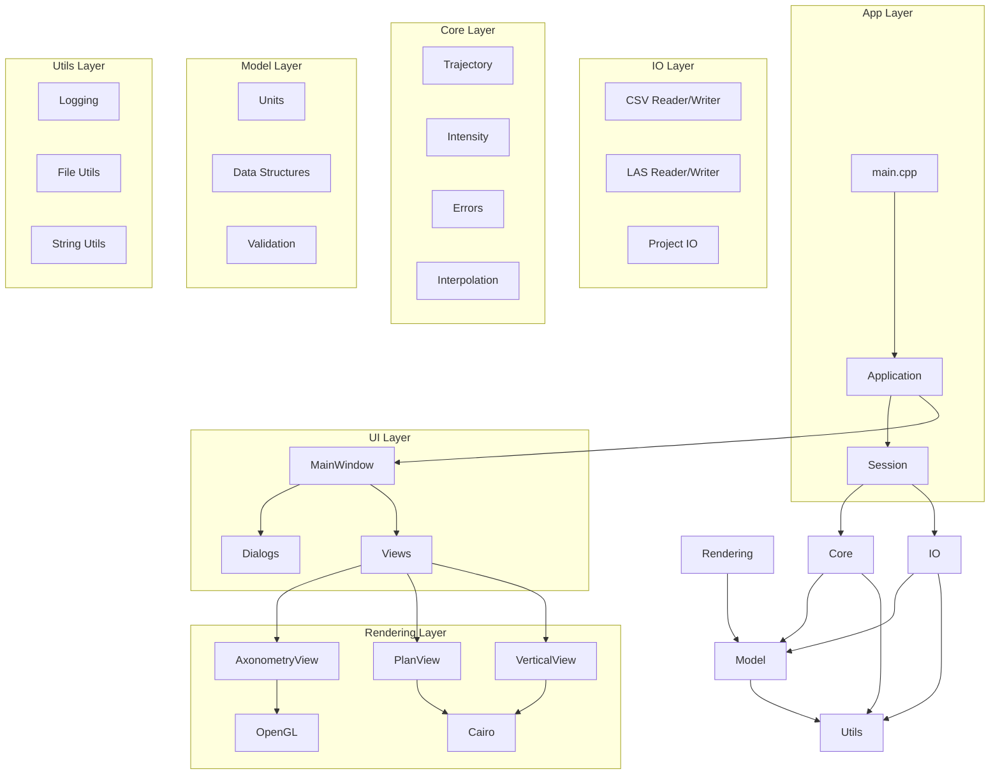
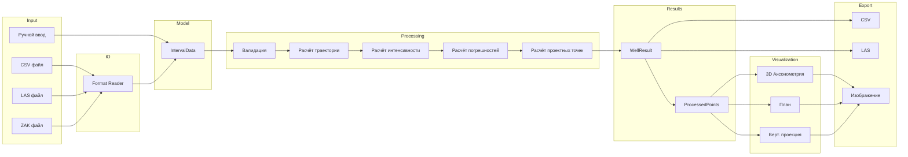
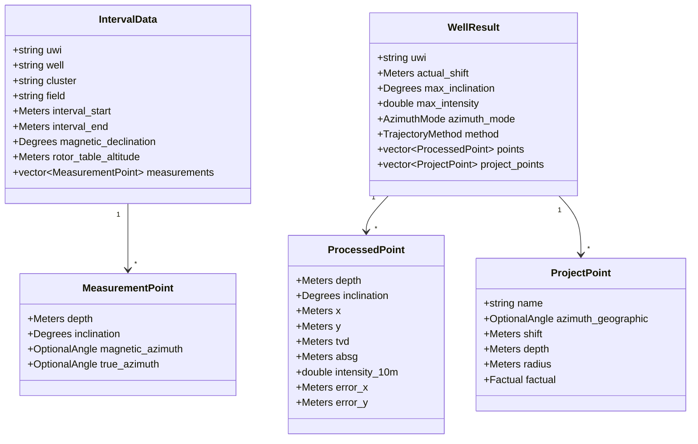
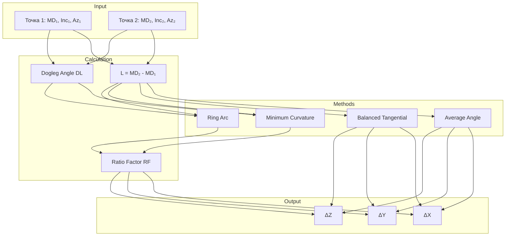
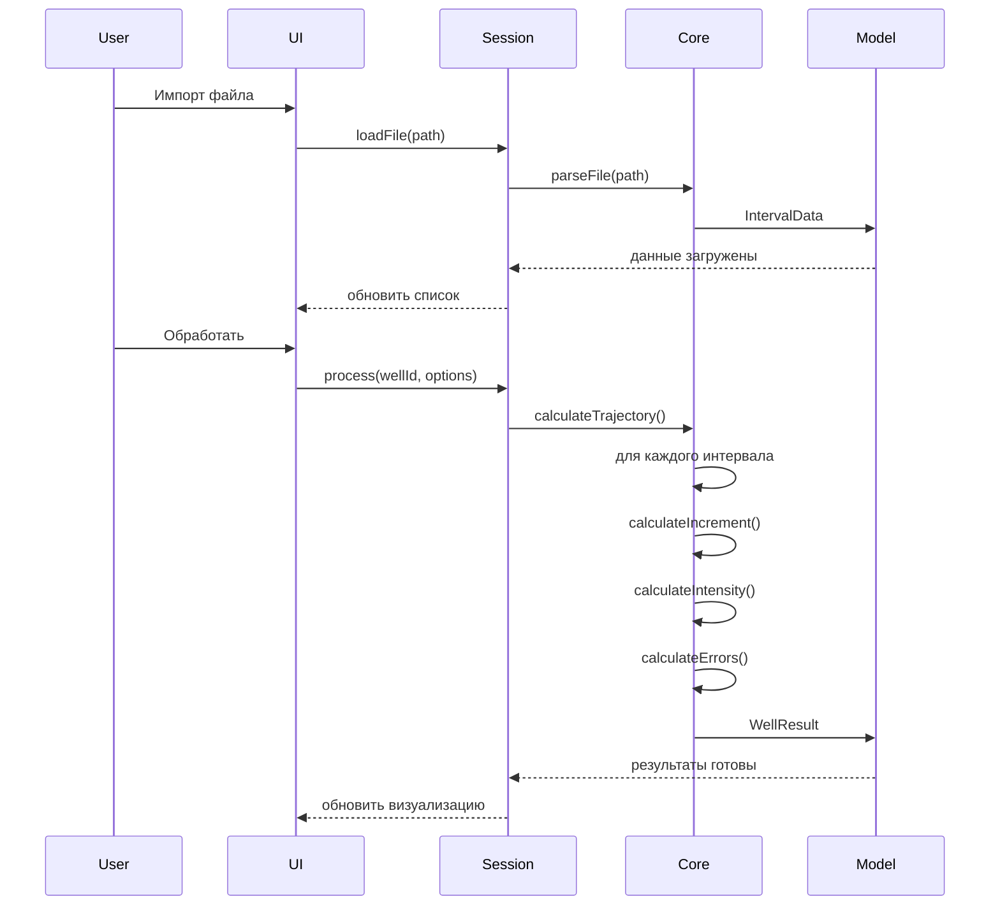
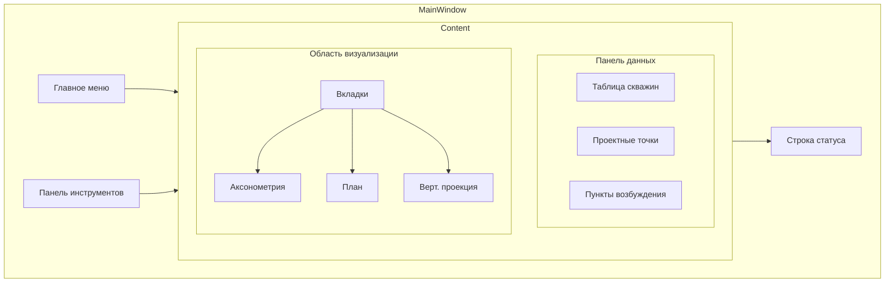
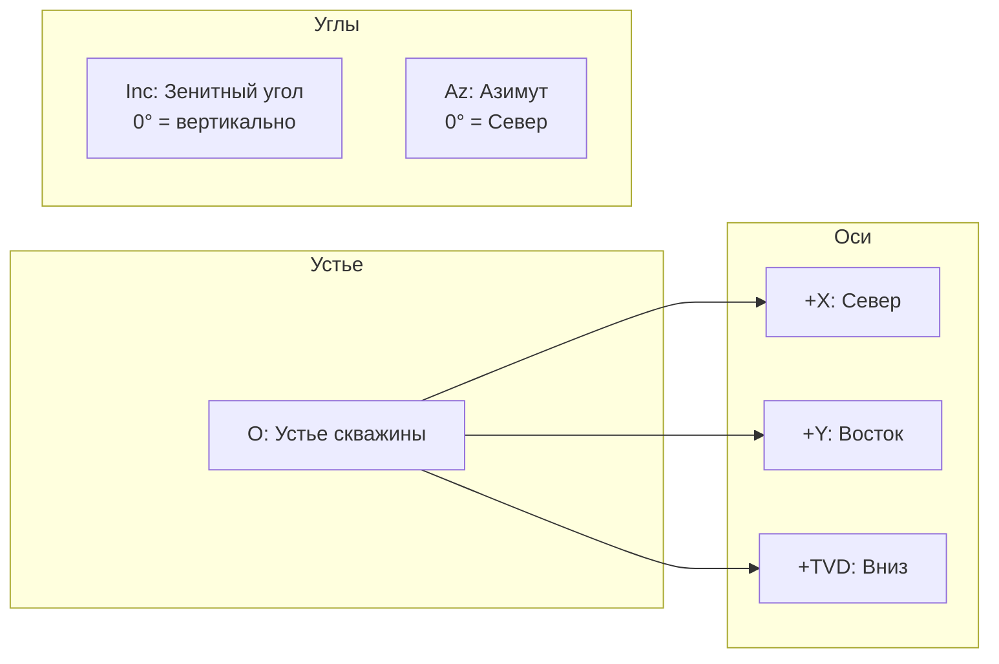
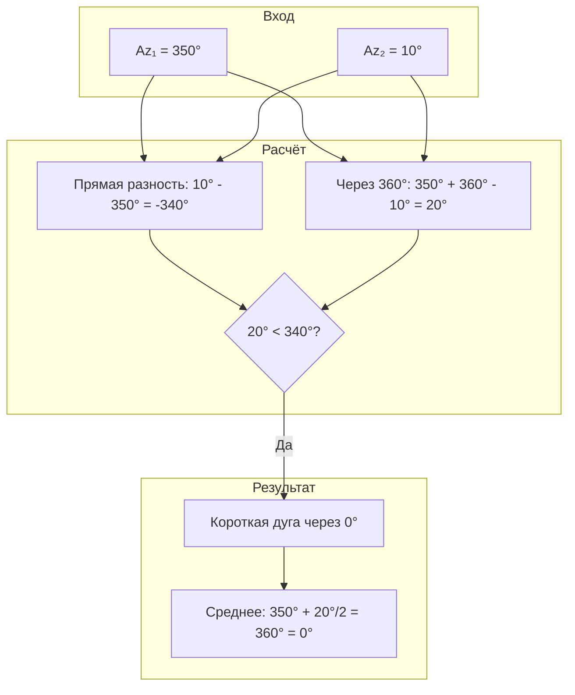
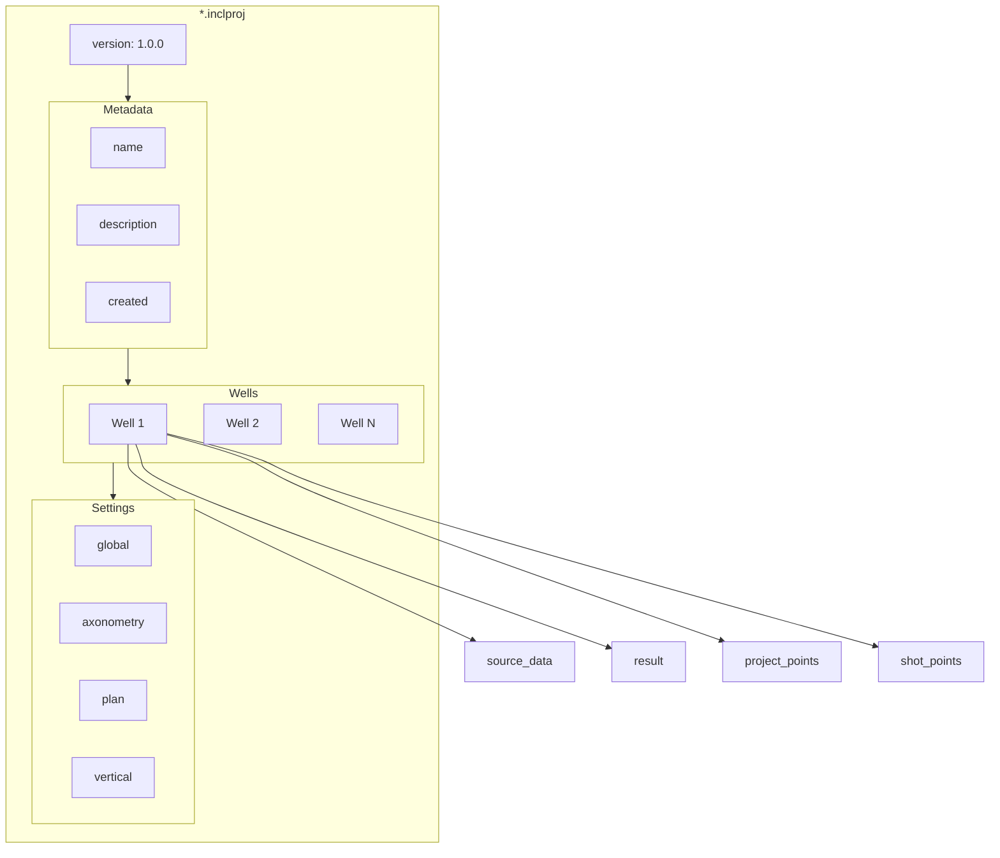
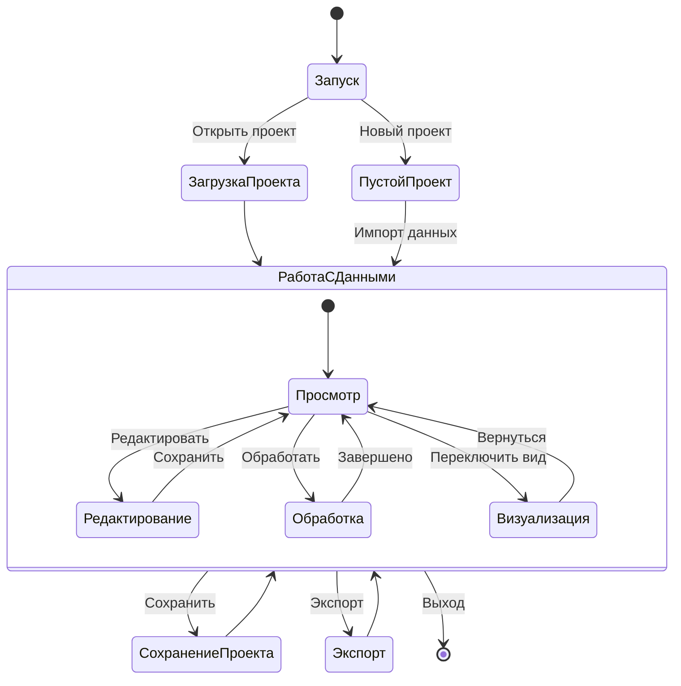

# Диаграммы Incline3D

Документ содержит визуальные диаграммы архитектуры и потоков данных приложения.

## 1. Архитектурные слои

## 2. Поток обработки данных

## 3. Структура данных скважины

## 4. Методы расчёта траектории

## 5. Цикл обработки скважины

## 6. Структура главного окна

## 7. Координатная система

## 8. Обработка азимутов около 0°/360°

## 9. Формат файла проекта

## 10. Жизненный цикл приложения

